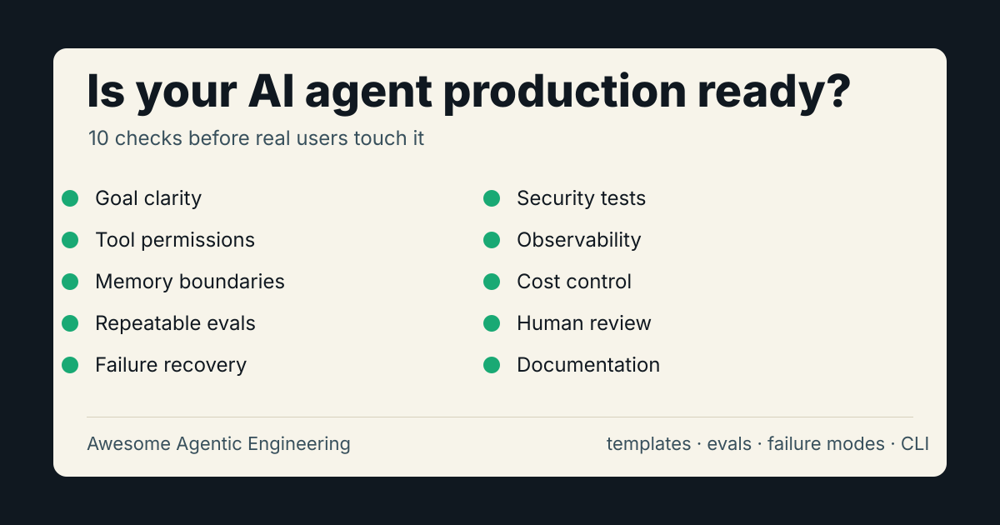

# Awesome Agentic Engineering

[English](README.md) | [简体中文](README.zh-CN.md)

一个面向真实业务落地的 AI Agent 工程化手册：模板、评估、架构模式、失败案例和发布清单。



大多数 AI Agent demo 能惊艳 5 分钟，但很难进入生产。真正的问题通常不是模型不够强，而是目标模糊、工具权限过大、记忆漂移、没有评估、成本失控、提示注入、失败不可见。

这个仓库的目标是帮助开发者把 Agent 做到可测试、可审查、可部署、可观测、可迭代。

## 为什么值得 star

- 你正在做 Agent，需要生产就绪检查清单。
- 你需要 Agent 规格、eval、上线评审模板。
- 你想把真实失败模式变成回归测试。
- 你需要审查 MCP server、工具权限或 Agent 工作流。

## 适合谁

如果你正在做这些东西，这个仓库适合你：

- Coding Agent
- Research Agent
- 客服 Agent
- 企业内部流程 Agent
- MCP 工具
- 带规划、工具调用、记忆、多步骤执行的 LLM 应用

建议先看：

- [Agent Card](templates/agent-card.md)：定义 Agent 做什么、不做什么、怎么安全失败。
- [Eval Plan](templates/eval-plan.md)：把 Agent 行为变成可测试场景。
- [Launch Checklist](templates/launch-checklist.md)：上线前做一次生产就绪检查。
- [Failure Modes](docs/failure-modes.md)：常见生产失败模式。
- [MCP Safety Checklist](docs/mcp-safety-checklist.md)：给 Agent 接入工具服务器前的安全检查。
- [Star Growth Playbook](docs/star-growth-playbook.md)：长期真实增长打法。

## 快速评分

用零依赖 CLI 检查一个 Agent Card JSON：

```bash
node bin/agentic-score.js examples/coding-agent.card.json
```

预期输出：

```text
Issue-to-PR Coding Agent v0.1

Score: 16/20
Rating: limited beta
```

clone 后也可以直接运行：

```bash
npm run score
npm test
```

发布到 GitHub 后，可以这样检查 star：

```bash
node bin/star-watch.js owner/repo --state .star-watch.json --target 1000 --text
```

仓库内置的 [Star Watch 工作流](.github/workflows/star-watch.yml) 每天执行同一检查，
并将快照保存为 GitHub Actions artifact。

## 生产级 Agent 评分卡

每项 0-2 分。

| 维度 | 0 分 | 1 分 | 2 分 |
| --- | --- | --- | --- |
| 目标清晰度 | 只有模糊 prompt | 有任务定义 | 有任务、用户和成功指标 |
| 工具权限 | 几乎无限制 | 有部分限制 | 最小权限原则 |
| 记忆 | 隐式或混乱 | 有基础状态 | 有范围、可检查、可删除 |
| 评估 | 没有 | 人工样例 | 可重复场景测试 |
| 失败处理 | 崩溃或隐藏错误 | 基础重试 | 明确降级和恢复路径 |
| 安全 | 未考虑 | 基础过滤 | 测过提示注入和数据边界 |
| 可观测性 | 没日志 | 有请求日志 | 有 trace、成本、延迟、结果 |
| 成本控制 | 不知道成本 | 有估算 | 有预算、告警和限制 |
| 人工审核 | 没有 | 可选审核 | 高风险动作强制审核 |
| 文档 | 只有 demo | 有安装说明 | 有安装、架构、威胁模型和案例 |

参考解释：

- 0-7：只能算 demo
- 8-14：原型
- 15-18：有限 beta
- 19-20：生产候选

## 核心原则

### 1. 窄 Agent，强流程

不要一开始就做通用 Agent。先做一个边界明确、能判断成败的流程。

好的例子：

- 给定 GitHub issue，生成 patch 并提交带测试的 PR。
- 给定客服工单，收集账户上下文并起草回复，等待人工确认。

弱的例子：

- 做一个自主软件工程师。
- 自动处理所有客户运营。

### 2. 工具调用必须像合约

每个工具都应该有：

- 明确用途
- 输入输出结构
- 权限边界
- 错误约定
- 日志行为

如果工具会修改外部状态，至少要有：

- 人工确认
- dry-run 模式
- 可逆操作
- 明确白名单

### 3. 先评估，再自治

提高 Agent 自治程度之前，先写场景测试。

好的 eval 应覆盖：

- 正常任务
- 模糊任务
- 缺失数据
- 工具失败
- 恶意指令
- 高成本请求
- 长任务

### 4. 记忆必须有边界

Agent 记忆应该可审查、可删除、有范围。

避免：

- 什么都塞进全局记忆
- 用户看不到的隐藏状态
- 永久保存但无法删除

优先：

- 项目级记忆
- 用户确认过的事实
- 有过期时间的摘要
- 带来源链接的记录

## 典型失败模式

### 静默失败

Agent 看起来回答得很自信，但跳过了关键步骤。

缓解方式：

- 使用 checklist
- 记录工具调用
- 要求结论必须带证据
- 定义 done means

### 工具滥用

Agent 过度调用昂贵或危险工具。

缓解方式：

- 限速
- 工具预算
- 权限分级
- 默认 dry-run

### 记忆漂移

Agent 不断积累过时或错误假设。

缓解方式：

- 定期审查记忆
- 设置过期时间
- 记录来源
- 只保存用户确认事实

### 提示注入

外部内容诱导 Agent 忽略规则、泄露数据或执行危险操作。

缓解方式：

- 把外部内容当作不可信数据
- 区分系统指令和外部资料
- 高风险动作走人工确认
- 用对抗样例测试

## 后续路线

- 增加 20 个真实 Agent 失败案例
- 增加 research、ops Agent 示例
- 增加生产就绪 badge
- 增加网页评分器

详见 [ROADMAP.md](ROADMAP.md)。

## 发布

GitHub 仓库发布设置见 [PUBLICATION.md](PUBLICATION.md)。

## 贡献

欢迎提交：

- 真实生产失败案例
- Agent 架构 before/after
- 常见工作流 eval 数据
- 安全测试样例
- 成本控制模式
- MCP server 审查清单

请先阅读 [CONTRIBUTING.md](CONTRIBUTING.md)。
