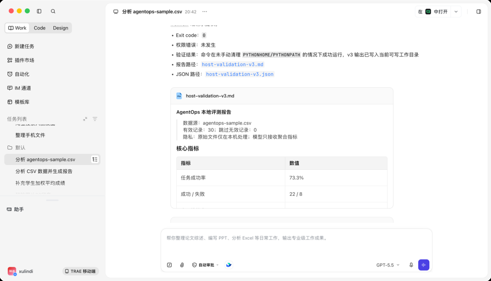
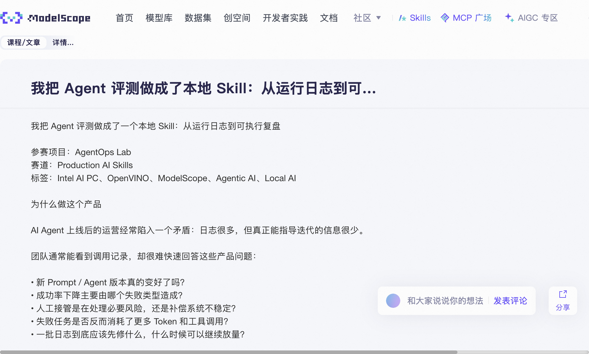

# Local AgentOps OpenVINO 验证记录

> 验证日期：2026-08-17
> 结论：OpenVINO 原生 IR 路径已在本地真实运行，报告与 JSON 指标成功生成。

## 验证环境

- OS：macOS 26.4.1 arm64；
- Python：3.11.15；
- OpenVINO：2026.3.0；
- OpenVINO GenAI：2026.3.0.0；
- 设备：`CPU`；
- 模型：Qwen2.5-0.5B-Instruct；
- 模型格式：OpenVINO FP16 IR；
- 输入：`examples/agentops-sample.csv`，30 条合成记录。

## 验证命令

```bash
AGENTOPS_VENV="$PWD/artifacts/openvino-venv" \
skills/local-agentops/scripts/run.sh \
  examples/agentops-sample.csv \
  --model-path artifacts/qwen2.5-0.5b-openvino-fp16 \
  --output artifacts/agentops-openvino-report.md \
  --json artifacts/agentops-openvino-metrics.json
```

真实输出：

```text
样本：30；成功率：73.3%；失败：8；报告：.../agentops-openvino-report.md
```

## 基准结果

一次包含模型加载、指标计算、本地生成和文件写入的完整冷启动：

| 指标 | 结果 |
| --- | ---: |
| 完整耗时 | 20.27 秒 |
| 峰值内存 | 约 1.26 GB |
| 有效记录 | 30 |
| 成功率 | 73.3% |
| 失败记录 | 8 |
| 最高频错误 | `tool_error`，4 次 |
| P95 延迟 | 9400 ms |

已连续运行三次成功。

## 断点续跑验证

使用隔离的 `AGENTOPS_RUNTIME_HOME` 写入待续状态后，通过当前平台固定入口执行：

```bash
AGENTOPS_RUNTIME_HOME="artifacts/continue-validation/.agentops-runtime" \
AGENTOPS_VENV="artifacts/openvino-venv" \
skills/local-agentops/scripts/run.sh \
  --continue \
  --model-path artifacts/qwen2.5-0.5b-openvino-fp16
```

验证结果：

- 成功恢复 30 条合成记录的分析；
- Markdown 与 JSON 输出均生成；
- OpenVINO 本地模型正常运行；
- 成功结束后 `agentops-pending.json` 自动删除；
- 退出码为 `0`。

## TRAE Work Host 验证

2026-08-17 在 TRAE Work 中通过全局安装的 `local-agentops` Skill 复测：

- Host 明确显示“已调用 1 次技能”；
- 仅调用 macOS 固定入口 `scripts/run.sh`；
- 未在命令前手动清理 `PYTHONHOME` 或 `PYTHONPATH`；
- 未绕过固定入口，未请求提权；
- 运行态写入 Host 当前可写工作目录，不写入只读 Skill 目录；
- 复用同一 Python 3.11 环境与 OpenVINO FP16 IR；
- 退出码为 `0`，无权限错误；
- 成功生成 `host-validation-v3.md` 与 `host-validation-v3.json`。



## ModelScope 文章发布

技术文章已发布至 ModelScope 研习社，并添加 `Intel AI PC` 专题：

- https://modelscope.cn/learn/435817



## 兼容性结论

最初尝试 Qwen2.5-1.5B GGUF INT4 时，Apple Silicon CPU 后端无法为量化
`matmul` 创建 oneDNN primitive。改用 OpenVINO 原生 FP16 IR 后运行成功。

因此默认 Skill 链路已调整为：

1. 下载 Qwen2.5-0.5B-Instruct 官方权重；
2. 首次运行时导出 OpenVINO FP16 IR；
3. 后续调用直接复用本地 IR；
4. 模型只接收聚合指标，不接收原始 Prompt 或回复；
5. 模型不可用时不回退云服务。

## 结论边界

- 本记录证明本地 OpenVINO CPU 推理链路可运行；
- 本记录证明 TRAE Work 可发现并稳定调用该 Agent Skill；
- 本记录不是 Intel GPU / NPU 性能数据；
- 比赛最终材料仍需在 Intel AI PC 或官方要求的目标环境补充 GPU / NPU 证据；
- 合成样例结果不能写成真实业务提升；
- 本地模型摘要是辅助信息，确定性指标与规则建议才是主决策依据。
